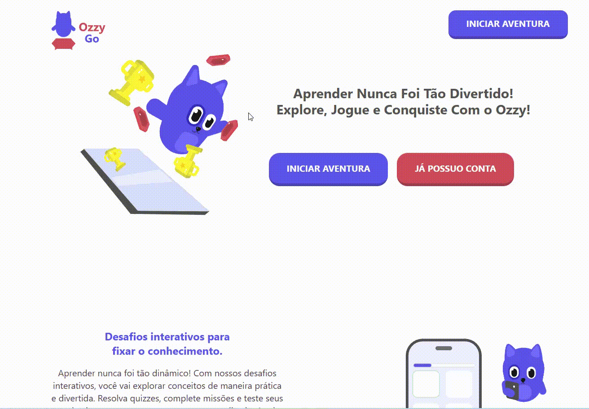

<p align="center">
  
</p>
<p align="center">
  <a href="#english">English</a>
  <a href="#portugues">Português</a>
</p>


# Português
# Sobre o Projeto


<p>
  O OzzyGo surgiu como uma ideia para um projeto de extensão da faculdade 
  <strong>Uninter</strong>, com foco em uma das ODS (Objetivos de Desenvolvimento Sustentável) da ONU. 
  O projeto busca utilizar a tecnologia aplicada à educação para transformar o aprendizado em uma experiência mais dinâmica, interativa e divertida.
</p>

<p>
  A proposta do OzzyGo é melhorar o dia a dia dos estudantes por meio da gamificação, incentivando o engajamento, a participação e a motivação dentro do ambiente educacional. 
  Dessa forma, o aprendizado deixa de ser apenas uma obrigação e passa a se tornar uma jornada mais leve e envolvente.
</p>

#  Como rodar o projeto
##  Tecnologias utilizadas 
<br>
<p align="center"> 
   
   
   
   
    
</p>

##  Pré-requisitos 
Antes de começar, recomenda-se utilizar o Docker para facilitar a instalação e execução do projeto. 
Certifique-se de possuir instalado: 
- Docker 
- Docker Compose 
- Node.js (caso deseje rodar sem Docker) 

##  Instalação 

### 1️⃣ Clone o repositório 
```bash 
git clone https://github.com/seu-usuario/seu-repositorio.git
```

### 2️⃣ Configure as variáveis de ambiente

Tanto no frontend quanto no backend, copie o arquivo `.env.example`:

```bash 
cp .env.example .env
```

### 3️⃣ Configure o banco de dados

O projeto utiliza:

- Neon Database
- PostgreSQL
- Drizzle ORM

Crie uma instância no Neon e adicione a URL de conexão no arquivo `.env`.

🔗 https://neon.tech

### 4️⃣ Configure o serviço de email

O sistema utiliza o Resend para envio de emails.

Crie uma conta e adicione sua API Key no `.env`.

🔗 https://resend.com

## Rodando com Docker

```bash 
docker compose up --build
```

Esse comando irá:

- Construir os containers
- Instalar dependências
- Inicializar frontend e backend

## Projeto iniciado

Após iniciar os containers, o projeto estará disponível em:

- Frontend:
http://localhost:5173

- Backend:
http://localhost:3000

<br>
<p align="center">
  
</p>

<br>


# English
# About the Project

<p>
  OzzyGo was created as an extension project idea for the 
  <strong>Uninter</strong> university, focused on one of the UN Sustainable Development Goals (SDGs). 
  The project aims to use technology applied to education to transform learning into a more dynamic, interactive, and fun experience.
</p>

<p>
  OzzyGo’s proposal is to improve students' daily learning experience through gamification, encouraging engagement, participation, and motivation within the educational environment. 
  In this way, learning becomes more than just an obligation and turns into a lighter and more immersive journey.
</p>

# How to run the project

## Technologies Used
<br>

<p align="center"> 
   
   
   
   
   
   
</p>

## Prerequisites

Before starting, it is recommended to use Docker to simplify the installation and execution process.

Make sure you have installed:

- Docker
- Docker Compose
- Node.js (if you want to run the project without Docker)

## Installation

### 1️⃣ Clone the repository

```bash
git clone https://github.com/your-username/your-repository.git
````

### 2️⃣ Configure environment variables

In both frontend and backend folders, copy the `.env.example` file:

```bash
cp .env.example .env
```

### 3️⃣ Configure the database

The project uses:

* Neon Database
* PostgreSQL
* Drizzle ORM

Create a Neon instance and add the connection URL to the `.env` file.

🔗 https://neon.tech

### 4️⃣ Configure the email service

The system uses Resend for sending emails.

Create an account and add your API Key to the `.env` file.

🔗 https://resend.com

## Running with Docker

```bash
docker compose up --build
```

This command will:

* Build the containers
* Install dependencies
* Initialize frontend and backend services

## Project started

After starting the containers, the project will be available at:

* Frontend:
  http://localhost:5173

* Backend:
  http://localhost:3000

<br>

<p align="center">
  
</p>

